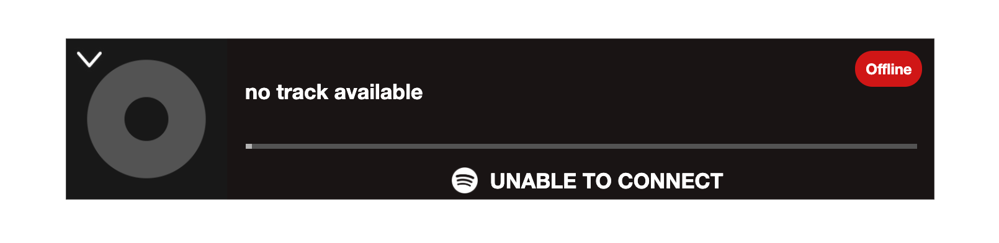

> This project's current status is:  ***Broken, fix incoming eventually***
> 
> Per a Heroku [blog post](https://blog.heroku.com/next-chapter): *"Starting November 28, 2022, we plan to stop offering free product plans and plan to start shutting down free dynos and data services"*
> 
> As this project relied upon a free Heroku dyno running a Node.JS server for the backend, it went down in November 2022, and for now I have not been able to find an alternate host. This will change when I have the time or money to fix it.

# My Girlfriend is Curious
### —about what I listen to on Spotify!

###### By [N. Escobar](https://nickesc.github.io)/[nickesc](https://nickesc.com)

> See the demo of the widget [here](https://nickesc.github.io/My-Girlfriend-is-Curious/)!

My girlfriend wants to know what I'm listening to, and I don't like Spotify displaying it on their app, so I wrote a small server and HTML tag using [`Spotify's API`](https://developer.spotify.com/documentation/web-api/) and [`thelinmichael/spotify-web-api-node`](https://github.com/thelinmichael/spotify-web-api-node) that will return and display my current listening activity.

> The player when I'm listening to a track on Spotify:
> 
>
> The player when I'm offline on Spotify:
> 

The goal with the frontend was to create an HTML tag that could be copied dropped into any project, as it was with scripting and styling inline. I wanted something that I could transplant to any webpage I wanted, including (as you can see in the [demo](https://nickesc.github.io/My-Girlfriend-is-Curious/)) Markdown without *too* much trouble. It struggles with images, especially the album cover width, and with some of the spacing, but works otherwise. This demo also, at the moment, only displays dummy data. The server it was housed on was shut down when Heroku removed their free tier, and I don't currently have an alternative so it isn't able to connect with the frontend.

The main thing to consider when dropping it into a site is that it'll make the bottom 100 pixels of your page invisible on mobile when it's expanded, so build with that in mind. And there can only be one of these at a time on your site, more will break any additional players. Honestly, I'm not sure where I'll use this, other than maybe my website, but it was a lot of fun to make.

The player is hidden by default, but on expanding it you can see it shows my currently playing track and its metadata (which all links back to Spotify), the current position in the song, player options like shuffle, and the playback device. If there is no song playing, it shows as "Offline." The player updates every five seconds, so it gives a near real-time view of what I'm listening to on Spotify.
